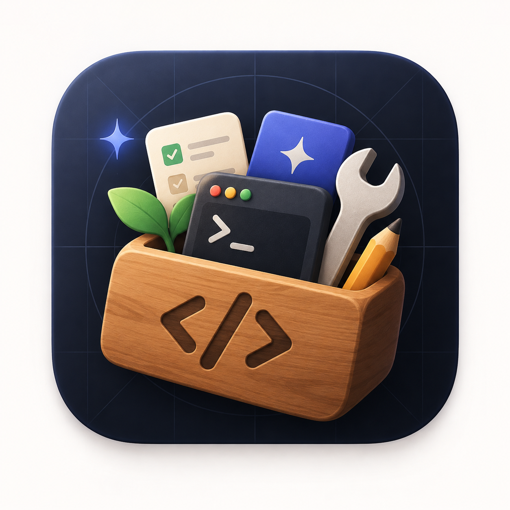

# Deco



Deco is a native desktop companion for mobile developers. It puts everyday device workflows in one clean window — no need to jump between Android Studio, Xcode, and the terminal.

Its first module is **simulator management**: Android emulators and iOS simulators side by side, with live status and common lifecycle operations. More companion modules are planned.

Built with [Tauri 2](https://tauri.app) (Rust backend) + React 19 + TypeScript.

## Features

Available now — **simulator management**:

**Android**
- **List emulators** — every AVD under `~/.android/avd`, with display name, API level, ABI, resolution, device profile, and system image
- **Live status** — `Running` / `Stopped` from `adb devices`, refreshed automatically
- **Lifecycle actions** — Start, Cold Start (`-no-snapshot-load`), Wipe Data (`-wipe-data`), Stop (`adb emu kill`)
- **Create & delete** — create AVDs from installed device definitions and system images; delete ones you no longer need
- **Snapshots** — save, restore, and delete emulator snapshots
- **Logs** — tail `adb logcat` output for a running emulator, with search and crash filter
- **SDK integration** — detects the Android SDK path, configurable in Settings; can open the `sdkmanager` UI

**iOS**
- **List simulators** — all available devices from `xcrun simctl`, with OS version and state
- **Lifecycle actions** — Boot, Shutdown, Erase

## Roadmap

Simulator management is the first module. Deco is meant to grow into a broader dev companion — further modules are still being shaped, so issues and ideas are welcome.

## Requirements

- macOS (primary target; Linux/Windows untested)
- Node.js 18+ and npm (`node --version`, `npm --version`)
- Rust stable toolchain via [rustup](https://rustup.rs) (`rustc --version`)
- Xcode command line tools (`xcode-select --install`) — required for Rust builds on macOS
- For Android: SDK with `emulator`, `platform-tools` (`adb`), and `cmdline-tools` (`avdmanager`, `sdkmanager`)
- For iOS: Xcode with at least one installed simulator runtime (`xcrun simctl list devices`)

The SDK path is resolved as `ANDROID_SDK_ROOT` → `ANDROID_HOME` → `~/Library/Android/sdk`, and can be overridden in the app's Settings.

## Getting started

### 1. Clone and install

```bash
git clone git@github.com:nandrasaputra/deco.git
cd deco/deco-tauri
npm install
```

### 2. Run in debug

This is the main day-to-day workflow — native window + Rust backend, with Vite hot reload for the frontend:

```bash
cd deco-tauri
npm run tauri dev
```

What happens: Vite serves the UI on `http://localhost:1420` (see `devUrl` in `src-tauri/tauri.conf.json`) and Tauri opens it in a native WebView. Edit files under `src/` and the window reloads; Rust changes in `src-tauri/src/` recompile and relaunch.

Frontend-only (no Rust backend — Tauri `invoke()` calls will fail):

```bash
npm run dev
```

### 3. Checks

Run before committing:

```bash
cd deco-tauri
npx tsc --noEmit        # frontend typecheck

cd src-tauri
cargo check             # backend check
```

`npm run build` (from `deco-tauri/`) runs `tsc && vite build` for a production frontend bundle into `dist/`.

### 4. Release build and install

```bash
cd deco-tauri
npm run tauri build
```

This runs the frontend production build, compiles Rust in release mode, then bundles the app. Output:

- `src-tauri/target/release/bundle/macos/Deco.app`
- `src-tauri/target/release/bundle/dmg/Deco_0.1.0_aarch64.dmg`

Install: open the `.dmg` and drag Deco to Applications. The app is unsigned, so on first launch right-click → Open to allow it (or `xattr -d com.apple.quarantine /Applications/Deco.app`).

Variants:

```bash
npm run tauri build -- --debug   # faster debug bundle for local testing
npm run tauri build -- --no-bundle  # compile `src-tauri/target/release/deco` binary only, skip .app/.dmg
```

### Troubleshooting

- `cargo: command not found` — install rustup and restart the shell so `~/.cargo/bin` is on `PATH`.
- Port `1420` in use — stop the other `vite`/`tauri dev` process, or change `devUrl` and Vite's port together.
- Blank window on `tauri dev` — make sure `npm run dev` alone loads at `http://localhost:1420` first; check the terminal running `beforeDevCommand` for errors.
- `adb` / emulator not found — set the SDK path in the app's Settings, or export `ANDROID_SDK_ROOT=$HOME/Library/Android/sdk`.
- `avdmanager` / `sdkmanager` missing — install `cmdline-tools;latest` via Android Studio's SDK Manager or `sdkmanager`.
- First `tauri build` is slow — Rust release compilation can take several minutes; subsequent builds are incremental.

## How it works

The Rust backend shells out to the standard Android SDK CLI tools — the frontend never shells out directly, it calls Tauri commands via `invoke()`:

| Tool | Used for |
| ---- | -------- |
| `emulator` | start / cold start / wipe an AVD |
| `adb` | device status, stop, snapshots, logcat |
| `avdmanager` | list device definitions, create/delete AVDs |
| `sdkmanager` | open the SDK manager UI |
| `xcrun simctl` | list, boot, shutdown, and erase iOS simulators |

AVD metadata is read from `~/.android/avd/<name>.avd/config.ini`. Running state is resolved by matching `adb devices` serials to AVD names via `adb -s <serial> emu avd name`.

## Project structure

```
deco-tauri/
  src/                 # React + TypeScript frontend (Vite)
    App.tsx            # main UI
    App.css            # styles
    main.tsx           # entry point
  src-tauri/           # Rust backend
    src/lib.rs         # all Tauri commands
    src/main.rs        # binary entry point
    tauri.conf.json    # window + bundle config
    icons/             # app icons (.icns, .ico, .png)
```

## Contributing

Issues and pull requests are welcome. For local agent/AI development notes, see `AGENTS.md`.

## License

No license file yet. If you plan to accept contributions, add one (e.g. `MIT LICENSE`) — GitHub will then pick it up automatically.
